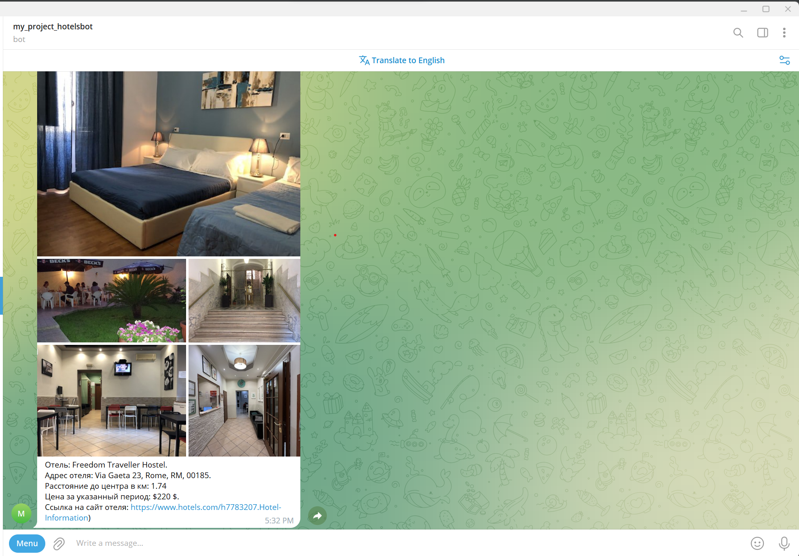

# Hotel Finder Telegram Bot
Telegram Bot, который помогает найти отели.

## Установка
1. В первую очередь, вам понадобится Python. Если у вас его еще нет — установите.

2. Склонируйте репозиторий.

3. Затем установите необходимые зависимости с помощью следующей команды:

    pip install -r requirements.txt

4. Зарегистрируйтесь на сайте RapidAPI (https://rapidapi.com/) и получите RAPIDAPIKEY.

5. Создайте бота в телеграме c помощью BotFather (https://telegram.me/BotFather) и получите токен для вашего бота.

6. В корне проекта создайте файл `.env`. В файле определите:

    BOT_TOKEN = 'токен вашего бота полученный с помощью BotFather'
    RAPID_API_KEY = 'ключ доступен в API после регистрации на сайте (https://rapidapi.com/)'

## Запуск Бота

1. В корневой директории проекта выполните команду 

    python main.py

2. Откройте Telegram, найдите вашего бота по имени и начните с нем диалог

## Функции

Бот помогает пользователям находить отели по их запросам. Благодаря связи с [API Hotels4](https://rapidapi.com/apidojo/api/hotels4/),
бот предоставляет информацию о различных отелях, включая цены, местоположение, количество звезд. А так же предоставляет 
ссылку на сайт отеля для получения всей интересующей информации.

## Дополнительная информация

Больше информации о запросах к API можно узнать на странице API Documentation (https://rapidapi.com/apidojo/api/hotels4/).

### Пример вывода Ботом информации об отеле

